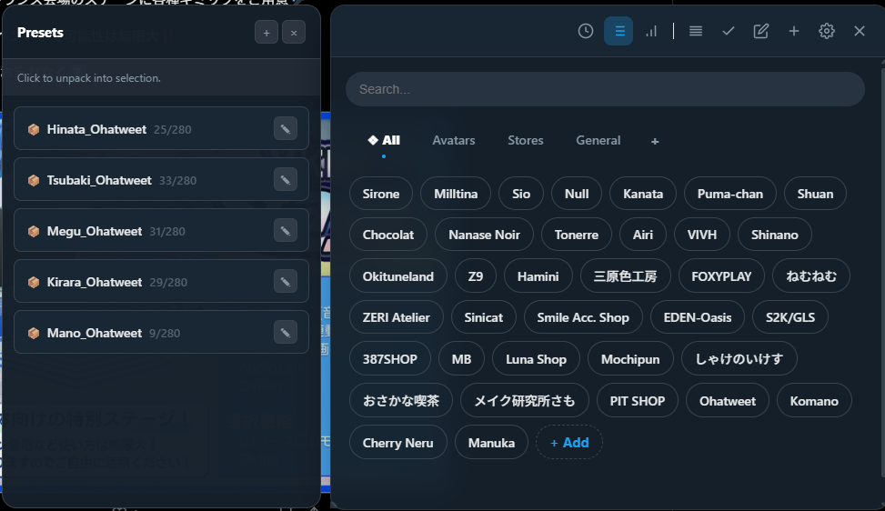

# **📦 Hashtag Manager Pro**

**Hashtag Manager Pro** 是一款旨在簡化 Twitter (X) 標籤管理和使用的瀏覽器擴充功能。它可以將標籤整理到分類中，建立拖放式預設，並使用獨特的「優先梯隊（Priority Ladder）」功能，確保最重要的標籤始終包含在字數限制內。

## **📖 開發背景**

這個工具是出於我進入 **VRChat** 社群時的個人需求而建立的。在發佈照片時，我想加入合適的標籤，但總是搜尋或保存在文字檔中非常麻煩。因此，我決定自己動手解決這個問題。

目標是提供一個工具來自動化繁瑣的流程，從而更容易與社群分享內容。

## **✨ 主要功能**

* **📂 動態分類:** 將標籤整理到自訂分頁中（例如：「模型」、「攝影」、「活動」）。  
* **🖱️ 拖放介面:** 在分類之間移動標籤，或直接將其拖入 Twitter/X 文字輸入框。  
* **🪜 優先排序:** 定義自訂排序順序。複製多個標籤時，高優先順序的標籤會首先加入，防止因字數限制被截斷。  
* **📦 智慧預設:** 儲存常用的標籤組合（例如：針對特定角色「Megu」），並一鍵解包使用。  
* **🌍 多語言支援:** 支援英語、日語、韓語、簡體中文和繁體中文。  
* **🎨 個人化:** 提供自動、亮色和暗色主題，採用玻璃擬態（Glassmorphism）設計。  
* **🔒 隱私專注:** 所有資料透過 Chrome Storage API 本地儲存在瀏覽器中。

## **🤖 開發說明**

「我把所有工作都交給了 AI。」

我（作者）設計了功能，指導了開發並進行了測試，但我本人沒有程式設計經驗。這個擴充功能完全是透過與 **Google Gemini** 合作構建的。

因此，對於經驗豐富的開發者來說，程式碼可能顯得有些基礎。它完全滿足了我的需求，但如果您是開發者並看到了改進的方法：**「我可以做得更好！」** 正是我希望看到的反應。請 Fork 並讓它變得更棒！

## **📥 安裝方法**

*注意：此擴充功能未在 Chrome 線上應用程式商店上架，需要手動安裝。*

1. **下載:** 前往 \[suspicious link removed\] 頁面，下載 Source code (zip) 或發佈的 .zip 檔案。  
2. **解壓縮:** 將檔案解壓縮到電腦上的資料夾中。  
3. **開啟擴充功能:**  
   * **Chrome/Brave:** chrome://extensions  
   * **Edge:** edge://extensions  
4. **啟用開發人員模式:** 開啟右上角的開關。  
5. **載入未封裝項目:** 點擊按鈕並選擇剛剛解壓縮的資料夾。  
6. **固定:** 點擊瀏覽器工具列中的拼圖圖示，將 **Hashtag Manager Pro** 固定。

## **🚀 使用方法**

### **基本用法**

1. **開啟:** 前往 X.com (Twitter) 並點擊擴充功能圖示。  
2. **建立分類:** 點擊分頁列表旁邊的 \+ 圖示建立新分類（分頁）。  
3. **新增標籤:** 點擊標籤列表末尾的 **\+ 新增** 晶片。可以用空格分隔一次新增多個標籤。  
4. **複製:** 只需點擊任何標籤晶片即可複製到剪貼簿。

### **多選模式**

使用勾選圖示切換到 **選擇模式**。您可以跨不同分類選擇標籤。

* **全部複製:** 點擊底部懸浮的「複製」欄，一次性複製所有選中的標籤。  
* **字數計數器:** 底部的計數器顯示標籤佔用的空間。  
  * *注意:* 日語、中文或韓語字元計為 2 個字元位。

### **優先排序 ("梯隊")**

開啟左側的 **優先梯隊抽屜**，定義哪些標籤最重要。

1. **新增:** 將標籤或整個分類拖入梯隊。  
2. **排序:** 上下拖動項目以更改優先順序。  
3. **邏輯:** 如果同時新增了標籤及其所屬分類，位置靠前的優先。  
4. **切換:** 可以使用抽屉內的開關開啟/關閉排序邏輯。

### **預設**

開啟 **預設抽屜** 管理組合。

* **建立:** 點擊 \+ 按鈕。您可以輸入標籤或將現有晶片拖入建立框。  
* **使用:** 點擊預設進行複製，或將其拖入任何文字欄位直接貼上。

## **🛠️ 技術堆疊**

* **核心:** Vanilla JavaScript (無框架)  
* **清單:** Chrome Extension Manifest V3  
* **樣式:** CSS (Glassmorphism)  
* **儲存:** chrome.storage.local (資料持久化)

## **🤝 貢獻**

**專案狀態:** 除了修復嚴重錯誤外，我不積極維護此專案。我建立它是為了解決自己的需求並與他人分享。

雖然如此，這是 **開源 (MIT)** 專案。如果您是開發者，請 Fork！

* 重構程式碼  
* 新增新功能  
* 修復 Bug  
* 將概念帶向全新的方向

## **🙏 致謝**

* **Google's Gemini:** 編寫程式碼。  
* **X 的管理層:** 刪除了基本功能，激勵我構建自己的工具。  
* **VRChat 社群:** 靈感來源。

## **📄 授權**

本專案基於 MIT 授權條款授權。
